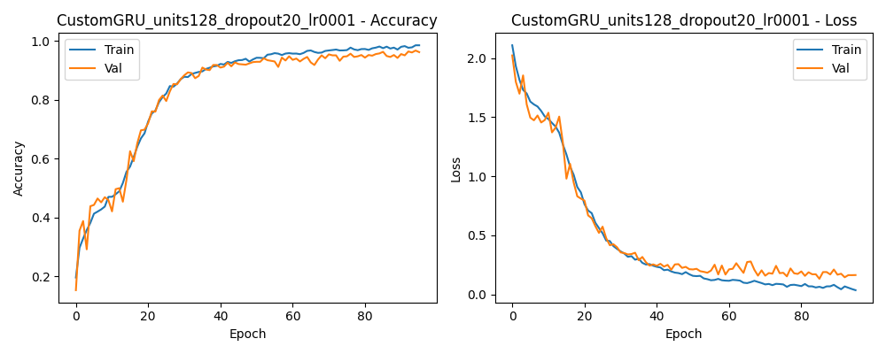
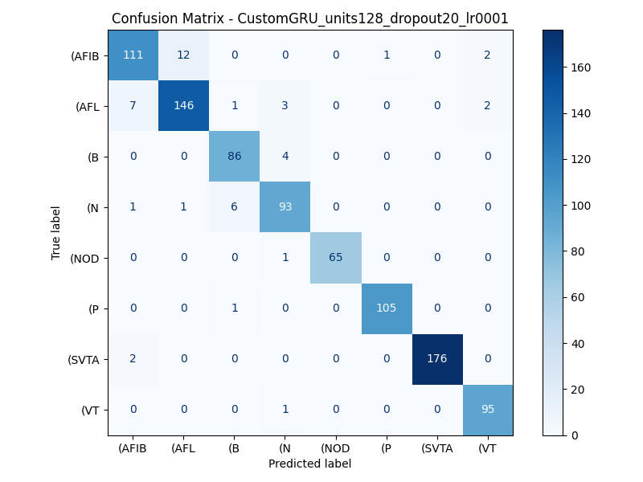
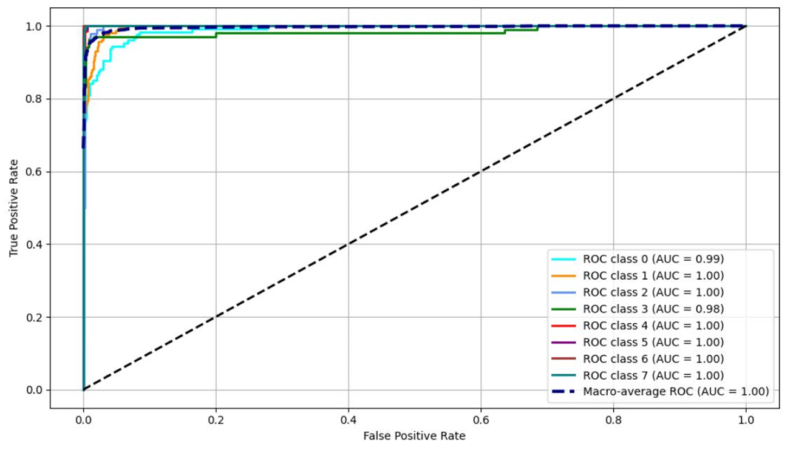

# Arrhythmia Classification in ECG Signals Using GRU and BiGRU
This repository contains my undergraduate thesis project in Biomedical Engineering. It implements a Deep Learning approach to automatically classify cardiac arrhythmias from Electrocardiogram (ECG) signals. Utilizing the MIT-BIH Arrhythmia Database, the project evaluates the effectiveness of Gated Recurrent Unit (GRU) [1] and Bidirectional GRU (BiGRU) architectures, combined with R-peak-based sliding window segmentation [2] and hyperparameter tuning.

## What this project does
This system processes raw ECG signals and classifies them into eight distinct cardiac rhythms:
- **AFIB** (Atrial Fibrillation) 
- **AFL** (Atrial Flutter) 
- **P** (Paced Rhythm) 
- **B** (Ventricular Bigeminy) 
- **VT** (Ventricular Tachycardia) 
- **SVTA** (Supraventricular Tachyarrhythmia) 
- **NOD** (Nodal / A-V Junctional Rhythm) 
- **N** (Normal Sinus Rhythm) 

The block diagram below illustrates the end-to-end pipeline developed for this arrhythmia classification using the MIT-BIH Arrhythmia Database.


<p align="center">
  <b>Figure 1: Project Block Diagram</b>
</p>

As illustrated in the system block diagram above, the project follows a structured workflow:
1. **Data Preparation & EDA** involves extracting the MIT-BIH Arrhythmia Database and performing Exploratory Data Analysis to understand the signal characteristics and class distributions.
2. **Data Pre-Processing** cleans the continuous ECG signals using a 4th-order Butterworth bandpass filter (0.5 - 45 Hz) to remove baseline wander and high-frequency noise, followed by Z-score normalization per window.
3. **Sliding Window** segments the long signals into fixed-length segments based on R-peak counts (3R, 5R, and 10R-peak windows) to capture dynamic temporal features [2].
4. **Classification Model** feeds the processed segments into two main Deep Learning architectures for comparison, namely GRU Variants (GRU0-GRU4) and Bidirectional GRU (BiGRU0-BiGRU4).
5. **Evaluation** assesses the model performance using comprehensive metrics such as Accuracy, Precision, Recall, F1-Score, and ROC-AUC.

### Classification Model
#### 1. GRU Variants (Custom Implementations)
The custom GRU variants (GRU1 - GRU4) implemented in the `src/` directory are heavily adapted and optimized from the foundational concepts presented by A. Kumarsinha [3]. The conventional GRU (GRU0) is based on the original architecture introduced by Cho et al. [1].

To make these raw architectures suitable for robust training on complex physiological time-series data (ECG) and fully compatible with the modern TensorFlow/Keras ecosystem, several major engineering improvements were applied to the original implementations:

* **Tensor Operation Optimization:** Replaced memory-intensive `tf.einsum` operations and manual bias matrices with highly efficient `tf.matmul` operations, leveraging TensorFlow's native broadcasting mechanisms to speed up computation.
* **Keras Serialization:** Integrated the `@register_keras_serializable()` decorator and explicitly defined `self.state_size`. This ensures the custom layers are fully compatible with the Keras API, allowing the trained models to be saved and loaded successfully for deployment.
* **Regularization (Dropout):** Introduced a `dropout_rate` parameter directly within the cell state calculations to mitigate overfitting, which was critical for achieving high validation accuracy.
* **Weight Initialization:** Switched the initialization method from standard `random_uniform` to `glorot_uniform` (Xavier Initialization) to stabilize gradient flow and accelerate model convergence during training.

#### 2. Custom Bidirectional Architecture (BiGRU)
This project implements a **Dual-RNN Bidirectional pipeline from scratch**:
* **Forward Path:** A standard RNN layer that processes the ECG sequence in chronological order.
* **Backward Path:** A parallel RNN layer that processes the sequence in reverse using the `go_backwards=True` argument. To ensure perfect temporal alignment with the forward path, a custom `tf.reverse` operation is applied to the output.
* **Feature Fusion:** The learned temporal representations from both directions are cleanly merged using `tf.keras.layers.Concatenate(axis=-1)` before being passed to the dense classification layers.

### Experiments
To find the optimal model for ECG arrhythmia classification, this project employed an extensive **Grid Search** approach. Rather than detailing all hundreds of combinations at once, the evaluation process is broken down into a systematic elimination pipeline (Funneling Strategy) consisting of three main phases:

#### 1. Hyperparameter Tuning (Baseline Establishment)
- **Objective:** Identify the most stable training configuration.
- **Process:** A systematic search was conducted across different units (32, 64, 128), dropout rates (0.2, 0.5), and learning rates (0.001, 0.0001).
- **Result:** The configuration of **128 units, a 0.2 dropout rate, and a 0.001 learning rate** yielded the best stability and accuracy. These hyperparameters were locked in for all subsequent phases.

#### 2. Architecture Comparison (Finding the Best Network)
- **Objective:** Determine the most effective Deep Learning architecture.
- **Process:** Using the locked hyperparameters, we evaluated the conventional GRU (GRU0) against four custom mathematical variants (GRU1-GRU4) and five bidirectional pipelines (BiGRU0-BiGRU4) across all variations of sliding windows.
- **Result:** The conventional **GRU0** consistently outperformed all custom variants and bidirectional models. Below are the top 3 best-performing architectures from this evaluation:
  
| Rank | Architecture | Accuracy | Precision | Recall | F1-Score | AUC |
| :---: | :--- | :---: | :---: | :---: | :---: | :---: |
| **1** | **GRU0 (Conventional)** | **95.99%** | **0.9582** | **0.9599** | **0.9580** | **0.99** |
| 2 | GRU2 (Custom Variant) | 95.78% | 0.9563 | 0.9578 | 0.9563 | 0.99 |
| 3 | BiGRU0 (Bidirectional)| 95.73% | 0.9566 | 0.9573 | 0.9561 | 0.99 |

#### 3. Sliding Window Variation (Finding the Optimal Sequence Length)
- **Objective:** Understand the effect of sequence length (temporal context) on the model's predictive power.
- **Process:** The winning architecture (**GRU0**) with the locked hyperparameters was evaluated individually across three different temporal contexts: 3R, 5R, and 10R-peak windows.
- **Result:** The shortest window (**3R-Peak**) provided the most optimal balance of temporal information and noise reduction, resulting in the highest overall metrics.

| Window Size | Accuracy | Precision | Recall | F1-Score | AUC |
| :--- | :---: | :---: | :---: | :---: | :---: |
| **3R-Peak** | **95.99%** | **0.9582** | **0.9599** | **0.9580** | **0.99** |
| 5R-Peak | 95.55% | 0.9553 | 0.9555 | 0.9542 | 0.99 |
| 10R-Peak | 94.62% | 0.9467 | 0.9462 | 0.9464 | 0.98 |

## Final Result
After evaluating multiple architectures and hyperparameters through an exhaustive grid search, the **Conventional GRU (GRU0)** paired with a **3R-Peak sliding window** emerged as the most optimal model. The winning configuration utilizes **128 units, a dropout rate of 0.2, and a learning rate of 0.001**. Below are the detailed performance visualizations and evaluation metrics of this best-performing model.
<p align="center">
  
</p>
<p align="center">
  <b>Figure 2: Training and Validation Accuracy & Loss GRU0</b>
</p>

The learning curves above illustrate the training process of the best-performing GRU0 model. 
- **Accuracy Curve (Left):** Both training and validation accuracy converge rapidly within the first 20 epochs, eventually stabilizing at approximately 96%.
- **Loss Curve (Right):** The training and validation loss smoothly decrease and plateau without significant divergence.

The minimal gap between the training and validation curves indicates that the model generalizes exceptionally well to unseen data without suffering from overfitting. This stability highlights the effectiveness of the chosen hyperparameters, particularly the application of a 0.2 dropout rate and the Z-score normalization technique used during the data preprocessing stage.

<p align="center">
  
</p>
<p align="center">
  <b>Figure 3: Confusion Matrix Conventional GRU0 - 3R Window</b>
</p>

The confusion matrix above demonstrates the robust discriminative ability of the GRU0 model across all eight arrhythmia classes. The prominent dark diagonal indicates a very high rate of True Positives, with minimal misclassifications across the board. This proves that the model successfully learns and generalizes the temporal patterns of the ECG signals, effectively distinguishing between different arrhythmias without being heavily biased towards the majority class.

<p align="center">
  
</p>
<p align="center">
  <b>Figure 4: ROC-AUC Conventional GRU0 - 3R Window</b>
</p>

The Receiver Operating Characteristic (ROC) curve above further validates the model's exceptional performance. Achieving a macro-average Area Under the Curve (AUC) of 0.99 indicates that the GRU0 model has a near-perfect ability to distinguish between the 8 different arrhythmia classes. The tightly clustered curves near the top-left corner demonstrate high sensitivity (True Positive Rate) while maintaining a very low False Positive Rate across all categories, proving the model's reliability in medical diagnostic scenarios.

| Class | Accuracy | Precision | Recall | F1-Score | AUC |
| :--- | :---: | :---: | :---: | :---: | :---: | 
| **AFIB** | 0.89 | 0.94 | 0.89 | 0.91 | 0.99 |
| **AFL** | 0.92 | 0.92 | 0.92 | 0.92 | 0.99 |
| **B** | 0.96 | 0.93 | 0.96 | 0.95 | 1 |
| **N** | 0.93 | 0.95 | 0.93 | 0.94 | 0.99 |
| **NOD** | 1 | 0.94 | 1 | 0.97 | 1 |
| **P** | 0.98 | 0.99 | 0.98 | 0.99 | 1 |
| **SVTA** | 0.99 | 1 | 0.99 | 1 | 1 |
| **VT** | 1 | 0.95 | 1 | 0.97 | 1 |

The table above details the comprehensive evaluation metrics of the GRU0 model across each individual arrhythmia class. The model achieved exceptional results, particularly in identifying Ventricular Tachycardia (VT) and Nodal rhythms (NOD), both of which scored a perfect 1.00 in Accuracy and Recall. Similarly, the SVTA class demonstrated flawless Precision and F1-Score (1.00). Most notably, the Area Under the Curve (AUC) is outstanding across the board, achieving either 0.99 or a perfect 1.00 for all classes. Even for complex and highly irregular rhythms such as Atrial Fibrillation (AFIB), the model maintains a robust predictive capacity (0.89 Accuracy and 0.99 AUC), underscoring its high reliability and effectiveness in distinguishing complex ECG morphological patterns.

## Getting Started
This project is built using Python and Jupyter Notebooks. You can run the code using your preferred environment, such as **Google Colab, local Jupyter Server, Visual Studio Code**, or any other IDE that supports `.ipynb` files.

### 1. Requirements
Clone the repository and install the required dependencies. (If you are using Google Colab, you can install the requirements directly in a notebook cell).
```bash
git clone https://github.com/winanannaa/Arrhythmia-Classification-in-ECG.git
cd Arrhythmia-Classification-in-ECG
```
Install all required Python packages.
```bash
pip install -r requirements.txt
```
If you are using Google Colab, you can run the command above directly in a notebook cell. 

### 2. Dataset Setup
This project uses the MIT-BIH Arrhythmia Database.
1.  Download the dataset from [PhysioNet](https://physionet.org/content/mitdb/1.0.0/).
2.  Extract the files and place them inside the `data/mit-bih-arrhythmia-database/` directory.

### 3. Running the Pipeline
To reproduce the experiments, you must execute the notebooks in the following order:
- Run `notebooks/EDA_and_Data_Preparation.ipynb` first. It will extract the raw ECG signals, apply bandpass filters, segment the windows, and save the processed data as      `.pkl` files. Remember to adjust the `SAVE_PATH` variable inside the notebook to match your local directory or Google Drive path.
- Once the `.pkl` files are generated, you can run `notebooks/GRU_Experiments.ipynb` & `notebooks/BiGRU_Experiments.ipynb` independently. They will automatically load the      preprocessed data, train the models, and visualize the evaluation metrics (Accuracy, ROC-AUC, Confusion Matrix, etc.).

## References
[1] K. Cho *et al.*, "Learning phrase representations using RNN encoder-decoder for statistical machine translation," in *EMNLP 2014 - 2014 Conference on Empirical Methods in Natural Language Processing*, 2014, pp. 1724-1734.  
[2] S. Mandala *et al.*, "An improved method to detect arrhythmia using ensemble learning-based model in multi lead electrocardiogram (ECG)," *PLOS One*, vol. 19, Apr. 2024.  
[3] A. Kumarsinha, "GRU Variants Comparing 5 different implementations of Gated Recurrent Units (GRU) in Keras/TensorFlow."
